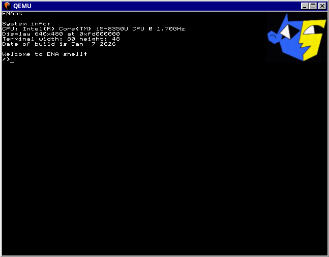

# ENAos

## What implemented:

> Longmode   
> GDT   
> IDT   
> Timer   
> Keyboard   
> Paging   
> PMM and VMM   
> Serial driver
> Text screen driver   
> Framebuffer driver   
> Terminal   

## How to build?

Install these packages:
You can change CC in Makefile to clang and remove -target section in CFLAGS
> make nasm clang grub mtools xorriso qemu-base qemu-system-x86_64 qemu-ui-sdl qemu-audio-pa

Go to terminal and write
> make build

To run system image in qemu type
> make debug

Or you can build and run just by
> make
